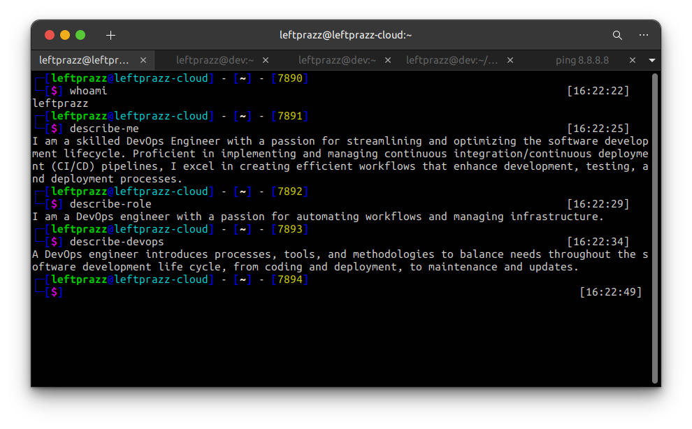

<h1 align="center">Hello there 👋, I'm Pras </h1>
<h3 align="center">A passionate DevOps Engineer</h3>

  

- 🌱 I’m currently learning **Python, Golang, Bash Script, Node.JS, Cloud Computing, CI/CD**

- 💬 Ask me about. **Cloud Computing, AWS, GCP, Docker, Docker Swarm, etc**

- 📫 How to reach me **akhmadprasetya27@gmail.com**

- ⚡ Interesting fact about me is: **I'm quiet with new people but funny with friends. Serious and focused at work, but humor and laughter define my friendships.**
 
<h3 align="center">Connect with me:</h3>

 

| <h3 align="center">OS:</h3>   | <h3 align="center">Languages:</h3> | <h3 align="center">Tools:</h3>      | <h3 align="center">Database:</h3>     | <h3 align="center">Cloud Computing:</h3> |
|--------------------------|-----------------------------|--------------------------|----------------------------|-----------------------------------|
| 
       
 | 
          
 | 
                
 | 
       
 | 
        
 |

 

  

