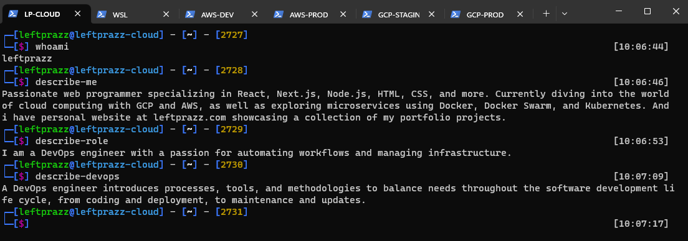

<h1 align="center">Hello there 👋, I'm Pras</h1>
<h3 align="center">A passionate DevOps Engineer</h3>

  

- 🌱 I’m currently learning **Python, Golang, Bash Script, Node.JS, Cloud Computing, CI/CD**

- 💬 Ask me about **Cloud Computing, AWS, GCP, Docker, Docker Swarm, etc**

- 📫 How to reach me **akhmadprasetya27@gmail.com**

- ⚡ Interesting fact about me is **that I'm quiet when I meet new people, but I'm funny when I've known them for a long time**
 
<h3 align="center">Connect with me:</h3>

 

<h3 align="center">Languages:</h3>

  

<h3 align="center">Tools:</h3>

  

  

  

  

  

<h3 align="center">OS:</h3>

  

  

<h3 align="center">Database:</h3>

  

  

 

